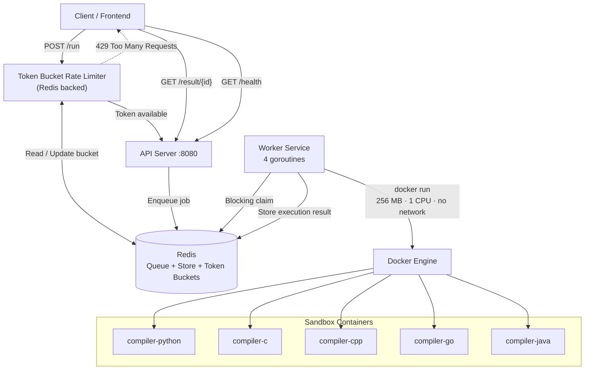
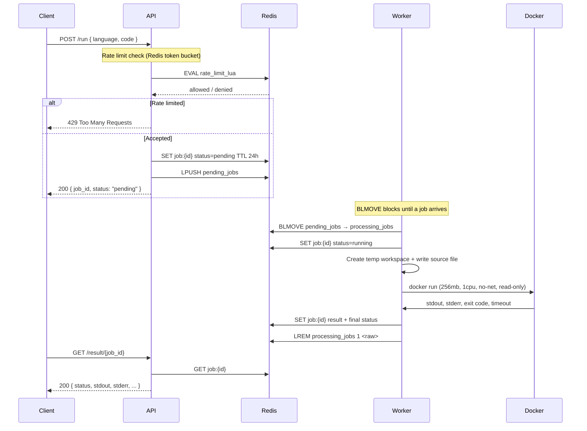

# Judex

> A distributed, multi-language code execution engine with Docker based sandbox isolation. Inspired by platforms like LeetCode, HackerRank, and Codeforces.

## Architecture



## Overview

This is a small but production oriented **online judge execution backend**. It accepts source code via HTTP requests, queues each submission in Redis, and processes them asynchronously using worker services. Each job is picked up from the queue and executed inside a short lived, heavily restricted Docker container with strict CPU, memory, filesystem, process, and network limitations to ensure isolation and security.

This project is intended for learning how real world coding platforms and internal code execution systems are built with concepts like distributed job queues, sandboxing, containerized execution, concurrency, and rate limited request handling in a scalable architecture.

## How It Works



## Key Features

| Feature | Details |
|---|---|
| **HTTP API** | Submit code to `/run`, poll results from `/result/{id}`, check heh at `/health` |
| **Async processing** | Jobs are queued in Redis and processed by a pool of background workers |
| **Redis backed queue** | FIFO ordering via `LPUSH` / blocking `BLMOVE` with atomic claim semantics |
| **Redis job store** | Full job state persisted as JSON with 24-hour TTL |
| **Redis rate limiter** | Distributed token bucket (10 burst, 1/sec refill) via Lua script — survives restarts and scales across instances |
| **Docker sandbox** | Each execution runs in a fresh container with 256 MB RAM, 1 CPU, no network, read-only rootfs, no capabilities, and `no-new-privileges` |
| **Multi-language** | Python, C, C++, Go, and Java |
| **Stuck job recovery** | Periodic scan requeues jobs claimed for >5 minutes |
| **Completed job cleanup** | Background goroutine deletes finished job records older than 15 minutes |
| **Horizontal scaling** | Stateless API; add more instances behind a load balancer. Rate limiter and queue are shared via Redis |

## Tech Stack

| Layer | Technology |
|---|---|
| Language | Go 1.25 |
| HTTP | `net/http` (stdlib) |
| Queue & Store | Redis 7 (via `go-redis/redis/v9`) |
| Sandbox | Docker (sibling containers via `/var/run/docker.sock`) |
| Deployment | Docker Compose |

## Getting Started

### Prerequisites

- Go 1.25+
- Docker (for sandbox execution)
- Redis 7+ (or the Docker image)

### Clone

```bash
git clone https://github.com/Dharshan2208/code-compiler.git
cd code-compiler
go mod download
```

### Build Sandbox Images

```bash
docker build -t compiler-python -f docker/python/Dockerfile docker/python
docker build -t compiler-cpp   -f docker/cpp/Dockerfile   docker/cpp
docker build -t compiler-c     -f docker/c/Dockerfile     docker/c
docker build -t compiler-java  -f docker/java/Dockerfile  docker/java
docker build -t compiler-go    -f docker/go/Dockerfile    docker/go
```

### Start Redis

```bash
docker run --rm --name code-compiler-redis -p 6379:6379 redis:7-alpine
```

### Run the API

```bash
go run ./cmd/api
```

### Run the Worker

In a separate terminal:

```bash
go run ./cmd/worker
```

## Configuration

| Variable | Required | Default | Used by | Description |
|---|---|---|---|---|
| `REDIS_ADDR` | No | `localhost:6379` | API, Worker | Redis server address. Docker Compose sets this to `redis:6379` automatically |

Create a `.env` file to override:

```bash
REDIS_ADDR=my-redis-host:6379
```

## Running Modes

### Development (standalone binaries)

```bash
# Terminal 1 — API
go run ./cmd/api

# Terminal 2 — Worker
go run ./cmd/worker
```

### Production (standalone binaries)

```bash
go build -o bin/api ./cmd/api
go build -o bin/worker ./cmd/worker

REDIS_ADDR=localhost:6379 ./bin/api
REDIS_ADDR=localhost:6379 ./bin/worker
```

### Docker Compose

```bash
mkdir -p /app/temp   # required for Docker socket bind mount
docker compose up --build
```

> The `docker-compose.yml` mounts `/app/temp:/app/temp` because the worker uses the host Docker engine through `/var/run/docker.sock`. Sandbox containers need to see the same workspace path.

## API Documentation

### `POST /run`

Submit a code execution job.

| Field | Value |
|---|---|
| Route | `/run` |
| Content-Type | `application/json` |

```json
{
  "language": "python",
  "code": "print(\"Hello from Python\")"
}
```

```json
{
  "job_id": "6d9b58ec-d381-4af4-a837-80aa3e13a8c9",
  "status": "pending"
}
```

### `GET /result/{job_id}`

Poll for job status and execution output.

| Field | Value |
|---|---|
| Route | `/result/{job_id}` |
| Status values | `pending`, `running`, `completed`, `failed`, `timeout`, `compile_error`, `runtime_error` |

**Completed Python job:**

```json
{
  "id": "6d9b58ec-d381-4af4-a837-80aa3e13a8c9",
  "language": "python",
  "status": "completed",
  "created_at": "2026-06-06T16:15:00.000000000Z",
  "claimed_at": "2026-06-06T16:15:01.000000000Z",
  "completed_at": "2026-06-06T16:15:01.120000000Z",
  "result": {
    "stdout": "Hello from Python\n",
    "stderr": "",
    "status": "success",
    "language": "python",
    "execution_time_ms": 120
  }
}
```

**C++ compile error:**

```json
{
  "id": "f1f8f70e-e765-42cc-86f0-d2189b871029",
  "language": "cpp",
  "status": "compile_error",
  "created_at": "2026-06-06T16:15:00.000000000Z",
  "claimed_at": "2026-06-06T16:15:01.000000000Z",
  "completed_at": "2026-06-06T16:15:01.090000000Z",
  "result": {
    "stdout": "",
    "stderr": "main.cpp: error output from g++",
    "status": "compile_error",
    "language": "cpp",
    "execution_time_ms": 0
  }
}
```

### `GET /health`

Service health and queue metrics.

| Field | Value |
|---|---|
| Route | `/health` |
| Success | `200 OK` |

```json
{
  "status": "ok",
  "queue_length": 0,
  "queue_capacity": 100,
  "submitted_jobs": 3,
  "completed_jobs": 0,
  "failed_jobs": 0
}
```

## Rate Limiting

The `/run` endpoint is protected by a **distributed token bucket** implemented as a Redis Lua script:

- **Capacity**: 10 tokens (burst of 10 requests)
- **Refill rate**: 1 token per second (sustained throughput)
- **Scope**: Per client IP
- **Storage**: Redis Hash key `ratelimit:{ip}` with 30 minute TTL
- **Atomicity**: The entire check-and-consume runs inside a single Lua script on Redis — safe across multiple API instances

Because the state lives in Redis, rate limits survive API restarts and work correctly behind a load balancer with multiple API replicas.

## Sandbox Security

Each execution runs in a Docker container with the following restrictions:

| Constraint | Value |
|---|---|
| Memory | 256 MB (`--memory=256m`) |
| CPU | 1 core (`--cpus=1`) |
| Processes | 64 max (`--pids-limit=64`) |
| Network | None (`--network=none`) |
| Filesystem | Read-only root (`--read-only`) |
| Temp | 64 MB tmpfs at `/tmp` |
| Privileges | None (`--security-opt=no-new-privileges`) |
| Capabilities | All dropped (`--cap-drop=ALL`) |
| Timeout | 10 seconds (context deadline) |

## TODO

- [ ] Deploy to a VPS
- [ ] Build a frontend
- [ ] Add more languages (Rust, JS..thats all ig)
- [ ] Improve the job queue with priority levels
- [ ] Write integration tests
